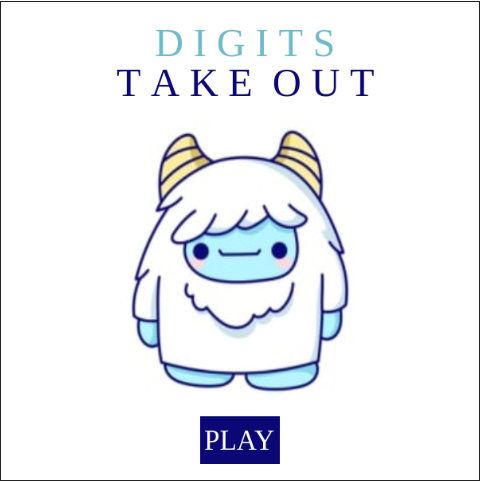

# Digits Take Out - Mini Game

"Digits Take Out - Mini Game" is an exhilarating Python project that blends gaming and graphics, developed with the Code in Place IDE. The game's objective is to satiate a hungry yeti by feeding it a series of meals. Failure to appease the yeti's appetite leads to a game over.

## Table of Contents

- [About the Game](#about-the-game)
- [How to Play](#how-to-play)
- [Features](#features)
- [Try It Out](#try-it-out)
- [Contributing](#contributing)
- [License](#license)

## About the Game

"Digits Take Out - Mini Game" is a project developed as part of Code in Place 2023's final project showcase. It offers an immersive gaming experience, combining gameplay challenges and graphics.

## How to Play

1. Begin by selecting the number of meals you want to feed the yeti.

2. As the game progresses, various digits representing meals will descend from the top of the screen.

3. Move your mouse horizontally to position a plate and collect falling digits.

4. Successfully gathering all the meals in a stage allows you to progress to the next level.

5. In stage 2, meals are located in different positions, requiring the yeti to be guided to collect them by moving in various directions—up, down, left, and right.

6. Be cautious and avoid collisions with walls, as they result in an angry yeti and a game over.

7. Successfully collecting all the meals in stage 2 leads to victory.

## Features

- Engaging gameplay testing your reflexes, hand-eye coordination, and strategic thinking.
- Immersive graphics and Python implementation.
- Fun and challenging stages.
- Provides an immersive gaming experience.

## Try It Out

You can play "Digits Take Out - Mini Game" by following this link: [Play the Game](https://codeinplace.stanford.edu/cip3/share/brmygjRvxAizH8gO3q99)

Enjoy the game and satisfy the yeti's cravings!

## Contributing

Contributions to this project are welcome. If you'd like to enhance the game or fix issues, please follow the [Contribution Guidelines](CONTRIBUTING.md).

## License

This project is licensed under the MIT License - see the [LICENSE](LICENSE) file for details.
